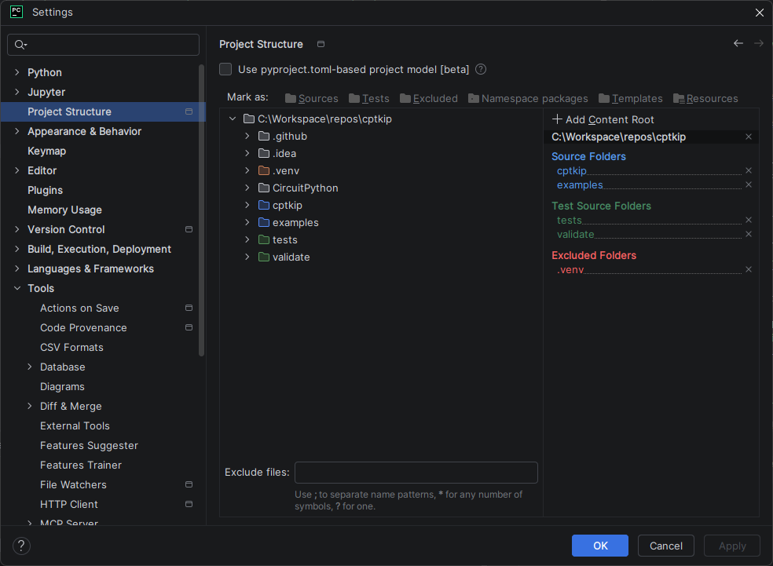

# Circuit Python Toolkit for Interactive Projects (CPTKIP)

Please see my website [Code Club Adventures](http://codeclubadventures.com/) for more coding materials.

## Origins

For details of the origins of this project, see [pico-interactive](https://github.com/danielbloy/pico-interactive).
This project is expected to be significantly different in structure and principles from the
original project, so I've decided to make it and new project rather than a version 2 of
[pico-interactive](https://github.com/danielbloy/pico-interactive) which I will continue to support as I use it in lots
of my existing
projects.

Rather than focus on a single universal framework (aimed primarily at Raspberry Pi Pico based
boards), this project aims to be more of a toolkit that supports a wide range of CircuitPython
divides as well as standard Python on a computer. It is designed to be both simpler to use and
simpler to extend/maintain than `pico-interactive` which requires a fair bit more boilerplate
to add new functionality. I have also tried to reduce the memory demands of using some of the
lower level modules such as logging which can be found in the `core` module.

## Overview

For information on how to setup a development environment, see
[development_environment.md](development_environment.md).

The structure of the project is arranged in the following modules (listed in
order of importance):

* `core` - required for every `cptkip` project as it provides information about execution
  environment, memory and logging. It has no dependencies on other `cptkip` packages.
* `config` - provides overridable configuration properties.
* `cpu` - provides information about the CPU and provides some operations.
* `task` - provides async thread runners and task scheduling that works across all supported
  platforms (CircuitPython and Python).
* `pin` - provides an abstraction layer to support environments with no physical pins.
* `device` - provides abstractions for hardware components.
* `animation` - provides additional animations such as `Flicker`.

The packages and their dependencies are illustrated in the table below.

|                    | `cptkip.core` | `cptkip.config` | `cptkip.cpu` | `cptkip.pin` | `cptkip.task` | `cptkip.device` |
|--------------------|:-------------:|:---------------:|:------------:|:------------:|:-------------:|:---------------:|
| `cptkip.core`      |      n/a      |                 |              |              |               |                 |
| `cptkip.config`    |      yes      |       n/a       |              |              |               |                 |
| `cptkip.cpu`       |      Yes      |                 |     n/a      |              |               |                 |
| `cptkip.pin`       |      Yes      |                 |              |     n/a      |               |                 |
| `cptkip.task`      |      Yes      |                 |              |              |      n/a      |                 |
| `cptkip.device`    |      Yes      |                 |              |     Yes      |               |       n/a       |
| `cptkip.animation` |               |                 |              |              |               |                 |

## Setting up a Development Environment

For details on setting up a development environment for this project, see
[development_environment.md](./development_environment.md).

In PyCharm, the following "Project Structure" is used:

## Roadmap and Changelog

For information on current development priorities, see [roadmap](./roadmap.md). For
details of releases, see [changelog](./changelog.md).

## License

All materials provided in this project is licensed under the Creative Commons Attribution-NonCommercial-ShareAlike 4.0
International License. To view a copy of this license, visit
<https://creativecommons.org/licenses/by-nc-sa/4.0/>.

In summary, this means that you are free to:

* **Share** — copy and redistribute the material in any medium or format.
* **Adapt** — remix, transform, and build upon the material.

Provided you follow these terms:

* **Attribution** — You must give appropriate credit , provide a link to the license, and indicate if changes were made.
  You may do so in any reasonable manner, but not in any way that suggests the licensor endorses you or your use.
* **NonCommercial** — You may not use the material for commercial purposes.
* **ShareAlike** — If you remix, transform, or build upon the material, you must distribute your contributions under the
  same license as the original.
